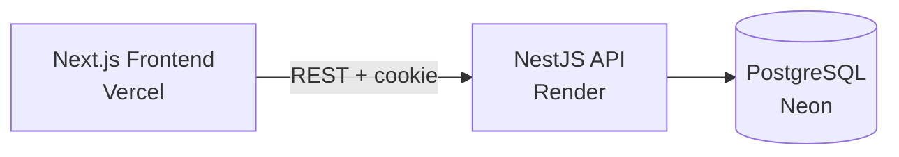

# Cairn

A task management app with full light/dark theming plus 6 selectable accent colors, guest login, and a NestJS + PostgreSQL backend.

[](./LICENSE)
[](https://cairn-task-management-tool.vercel.app)
[](https://cairn-task-management-tool-api.onrender.com)

## 🚧 Project status

This project is being continously updated. Current state:

| Area | Status |
|---|---|
| Login screen (Guest + Google OAuth) | ✅ Done, tested end-to-end |
| App sidebar shell (incl. mobile nav drawer) | ✅ Done |
| Theming — light/dark + persistence | ✅ Done |
| 6-accent color mode | ✅ Done |
| Backend (auth, Task/Project CRUD, validation, Swagger docs) | ✅ Done |
| Tasks screen (Kanban board, drag-and-drop) | ✅ Done |
| Projects screen (list view) | ✅ Done |
| Task Detail | ✅ Done — a few fields (description editing, subtasks, comments) intentionally deferred, see below |
| Project Detail | ✅ Done |
| Settings | ✅ Done — avatar upload and email editing intentionally deferred, see below |
| Responsive pass (mobile/tablet) | ✅ Done |
| Tests & CI | ❌ Not started |

See [Known limitations](#known-limitations--roadmap) below for the honest, current-as-of-now picture.

## Live demo

- **Frontend:** https://cairn-task-management-tool.vercel.app
- **Backend API:** https://cairn-task-management-tool-api.onrender.com
- **API docs (Swagger):** https://cairn-task-management-tool-api.onrender.com/api/docs

> **Note:** the backend is hosted on Render's free tier, which spins down after ~15 minutes of inactivity. The first request after a period of idle time can take 30–60 seconds to wake up — this is expected, not a bug. Use **Continue as Guest** on the login screen for the fastest way to try the app.

## Features

- **Guest Login** — try the app instantly with no account, or sign in with Google
- **Theming** — light/dark mode that persists across refreshes, plus 6 independent accent colors (Amber, Blue, Pink, Rose, Emerald, Black)
- **Typed API client** — frontend and backend share types generated from the backend's OpenAPI schema
- **Validated REST API** — NestJS backend with DTO validation, ownership checks, and auto-generated Swagger docs

## Tech stack

| Layer | Choice |
|---|---|
| Frontend | Next.js 16 (App Router), TypeScript, Tailwind CSS v4, shadcn/ui |
| Server state | TanStack Query, typed via `openapi-fetch` |
| Backend | NestJS, class-validator/class-transformer DTOs |
| ORM / Database | Prisma v7 + PostgreSQL (Neon) |
| Auth | JWT via httpOnly cookie, Guest Login + Google OAuth (Passport) |
| Frontend hosting | Vercel |
| Backend hosting | Render |
| Database hosting | Neon |

## Architecture



## Local setup

```bash
# 1. Clone
git clone https://github.com/NikharAsthana/cairn-task-management-tool.git
cd cairn-task-management-tool

# 2. Install (pnpm workspace — installs both apps)
pnpm install

# 3. Set up environment variables (see table below)
cp apps/api/.env.example apps/api/.env
cp apps/web/.env.example apps/web/.env.local

# 4. Run database migrations
pnpm --filter api prisma migrate dev

# 5. Start both apps in dev mode
pnpm --filter api dev     # API on http://localhost:3010
pnpm --filter web dev     # Web on http://localhost:3001
```

### Environment variables

**`apps/api/.env`**

| Variable | Description | Required? |
|---|---|---|
| `DATABASE_URL` | PostgreSQL connection string (Neon) | Yes |
| `PORT` | API port (defaults to 3000 if unset — see note below) | Recommended |
| `JWT_SECRET` | Secret used to sign auth JWTs | Yes |
| `GOOGLE_CLIENT_ID` | Google OAuth client ID | Yes |
| `GOOGLE_CLIENT_SECRET` | Google OAuth client secret | Yes |
| `GOOGLE_CALLBACK_URL` | OAuth redirect URI — must match Google Cloud Console | Yes |
| `FRONTEND_URL` | Allowed CORS origin | Yes |

**`apps/web/.env.local`**

| Variable | Description | Required? |
|---|---|---|
| `NEXT_PUBLIC_API_URL` | Base URL of the API | Yes |
| `DATABASE_URL` | Base URL of the Database | Yes |


> If you change `PORT`, remember to also update `GOOGLE_CALLBACK_URL`, the redirect URI in Google Cloud Console, and `NEXT_PUBLIC_API_URL` — there's currently no single source of truth for the port.

## Design deviations from the Figma source

- **Icon library**: Figma specifies Remix Icon; implemented with Lucide instead, to match shadcn's default icon set and avoid a second icon dependency.
- **Dark mode palette**: fully derived from shadcn's standard semantic relationships, not pulled from Figma — the source file's variable-mode switcher isn't accessible under view-only access.
- **Accent color modes** (Amber/Blue/Pink/Rose/Emerald): hex values derived using the same reasoning as dark mode, for the same access-limitation reason. "Black" is the base palette, built from confirmed Figma values.
- **Login screen copy**: the source file's subtext read "Enter your email below to login," but no email field exists on the screen — only Guest and Google options. Copy was changed to describe what's actually offered.
- **"Backlog" status**: exists as a valid value in the data model but isn't rendered as a board column anywhere in the source file.
- **Primary action button label**: source file shows both "+ Add Task" and "+ Add Project" inconsistently on the same screen type — likely a template leftover, not corrected in this implementation.
- **Account dropdown email field**: Figma shows an email address here; the `/auth/me` response doesn't currently return one, so username is shown instead.

## Known limitations / roadmap

- Tasks screen (the core CRUD UI) is not yet built — backend endpoints are ready and tested, this is pending frontend work.
- No responsive pass has been done yet on any screen.
- Task Detail, Project Detail, and Settings are planned as simple stub pages rather than full implementations, given time constraints.
- No automated tests or CI pipeline in this build — deprioritized in favor of shipping core functionality.
- No Kanban/drag-and-drop view — list view only.

## License

MIT — see [LICENSE](./LICENSE).
