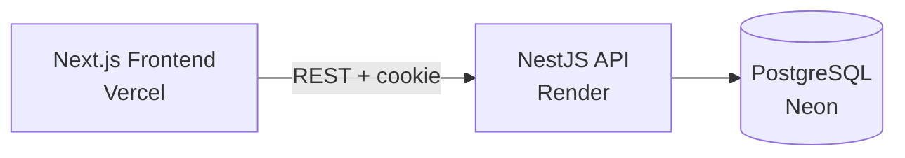

# Cairn

A task management app with full light/dark theming plus 6 selectable accent colors, guest login, and a NestJS + PostgreSQL backend.

[](./LICENSE)
[](https://cairn-task-management-tool.vercel.app)
[](https://cairn-task-management-tool-api.onrender.com)
[](https://github.com/NikharAsthana/cairn-task-management-tool/actions/workflows/ci.yml)

## Feature status

| Area | Status |
|---|---|
| Login screen (Guest + Google OAuth) | ✅ Done, tested end-to-end |
| App sidebar shell (incl. mobile nav drawer) | ✅ Done |
| Theming — light/dark + persistence | ✅ Done |
| 6-accent color mode | ✅ Done |
| Backend (auth, Task/Project CRUD, validation, Swagger docs) | ✅ Done |
| Tasks screen (Kanban board, drag-and-drop) | ✅ Done |
| Projects screen (list view) | ✅ Done |
| Task Detail | ✅ Done — a few fields (description editing, subtasks, comments) intentionally deferred, see below |
| Project Detail | ✅ Done |
| Settings | ✅ Done — avatar upload and email editing intentionally deferred, see below |
| Responsive pass (mobile/tablet) | ✅ Done |
| Tests & CI | ✅ Done |

See [Known limitations / roadmap](#known-limitations--roadmap) below for the honest, current-as-of-now picture.

## Live demo

- **Frontend:** https://cairn-task-management-tool.vercel.app
- **Backend API:** https://cairn-task-management-tool-api.onrender.com
- **API docs (Swagger):** https://cairn-task-management-tool-api.onrender.com/api/docs

> **Note:** the backend is hosted on Render's free tier, which spins down after ~15 minutes of inactivity. The first request after a period of idle time can take 30–60 seconds to wake up — this is expected, not a bug. Use **Continue as Guest** on the login screen for the fastest way to try the app.

## Features

- **Guest Login** — try the app instantly with no account, or sign in with Google
- **Theming** — light/dark mode that persists across refreshes, plus 6 independent accent colors (Amber, Blue, Pink, Rose, Emerald, Black)
- **Typed API client** — frontend and backend share types generated from the backend's OpenAPI schema
- **Validated REST API** — NestJS backend with DTO validation, ownership checks, and auto-generated Swagger docs
- **Drag-and-drop Kanban board** — cross-column status changes with optimistic updates and full keyboard support

## Tech stack

| Layer | Choice |
|---|---|
| Frontend | Next.js 16 (App Router), TypeScript, Tailwind CSS v4, shadcn/ui |
| Server state | TanStack Query, typed via `openapi-fetch` |
| Backend | NestJS, class-validator/class-transformer DTOs |
| ORM / Database | Prisma v7 + PostgreSQL (Neon) |
| Auth | JWT via httpOnly cookie, Guest Login + Google OAuth (Passport) |
| Testing / CI | Jest unit + e2e tests, GitHub Actions |
| Frontend hosting | Vercel |
| Backend hosting | Render |
| Database hosting | Neon |

## Architecture



## Local setup

```bash
# 1. Clone
git clone https://github.com/NikharAsthana/cairn-task-management-tool.git
cd cairn-task-management-tool

# 2. Install (pnpm workspace — installs both apps)
pnpm install

# 3. Set up environment variables (see table below)
cp apps/api/.env.example apps/api/.env
cp apps/web/.env.example apps/web/.env.local

# 4. Run database migrations
pnpm --filter api exec prisma migrate dev

# 5. Start both apps in dev mode
pnpm --filter api dev     # API on http://localhost:3010
pnpm --filter web dev     # Web on http://localhost:3001
```

### Running the tests

```bash
# Backend unit tests
pnpm --filter api test

# Backend e2e tests — needs a disposable local Postgres first:
docker run --rm -d --name cairn-test-db -p 5433:5432 \
  -e POSTGRES_PASSWORD=test -e POSTGRES_DB=cairn_test postgres:17
pnpm --filter api test:e2e:migrate
pnpm --filter api test:e2e
```

### Environment variables

**`apps/api/.env`**

| Variable | Description | Required? |
|---|---|---|
| `DATABASE_URL` | PostgreSQL connection string (Neon) | Yes |
| `PORT` | API port (defaults to 3000 if unset — see note below) | Recommended |
| `JWT_SECRET` | Secret used to sign auth JWTs | Yes |
| `JWT_EXPIRES_IN` | JWT lifetime, in seconds | Yes |
| `GOOGLE_CLIENT_ID` | Google OAuth client ID | Yes |
| `GOOGLE_CLIENT_SECRET` | Google OAuth client secret | Yes |
| `GOOGLE_CALLBACK_URL` | OAuth redirect URI — must match Google Cloud Console | Yes |
| `FRONTEND_URL` | Allowed CORS origin | Yes |

**`apps/web/.env.local`**

| Variable | Description | Required? |
|---|---|---|
| `NEXT_PUBLIC_API_URL` | Base URL of the API | Yes |

> If you change `PORT`, remember to also update `GOOGLE_CALLBACK_URL`, the redirect URI in Google Cloud Console, and `NEXT_PUBLIC_API_URL` — there's currently no single source of truth for the port.

## Design decisions & trade-offs

**Monorepo over separate repos.** A pnpm workspace with `apps/web` and `apps/api` in one repository, mainly for shared types end-to-end — the frontend's API client is generated directly from the backend's OpenAPI schema, so a backend DTO change surfaces as a type error in the frontend immediately, rather than as a runtime bug discovered later.

**TypeScript pinned to `^6.0.0`.** TypeScript 7.0's Go-native rewrite broke the Nest CLI and type-aware ESLint at the time this project started. Pinned to the last version everything in the stack actually supported, rather than chasing bleeding-edge compatibility mid-build.

**Prisma v7 with an explicit driver adapter.** Prisma v7 dropped the bundled Rust query engine by default in favor of an explicit adapter (`@prisma/adapter-pg`). Went with the current generation rather than an older tutorial's approach — smaller, faster, and where the ecosystem is actually heading.

**JWT delivered via an httpOnly, Secure cookie, not `localStorage`.** `localStorage` is readable by any JavaScript on the page, making it vulnerable to XSS token theft; an httpOnly cookie can't be read by client-side JS at all. The trade-off: frontend and backend live on different domains, so this requires `credentials: true` and an explicit CORS origin allow-list instead of a wildcard — more setup, for meaningfully better security.

**Neon over Render's own free Postgres.** Render's free-tier Postgres auto-expires 30 days after creation; this assessment requires a live deployment for 45 days. Neon's free tier has no such expiry — the difference between the demo quietly dying at day 31 and still working at day 44.

**dnd-kit, without `@dnd-kit/sortable`.** `dnd-kit` is the current community standard for React drag-and-drop. `Task` has no `order`/`position` field in the schema, so only cross-column drag (status changes) is wired up — not within-column reordering. Scoped the feature to what the data model actually supports, rather than bolting on reordering with no backing field.

**Global `ValidationPipe` with `whitelist: true` and `forbidNonWhitelisted: true`.** Unexpected fields in a request body aren't silently stripped — the whole request is rejected with `400`. Confirmed directly while writing e2e tests: sending a spoofed `reporterId` on task creation to prove the field gets ignored instead got the request rejected outright, since `CreateTaskDto` doesn't define that field. A stronger guarantee than "ignored."

**Authorization scoped server-side, never trusted from the client.** Every task/project query is scoped to a `workspaceId` derived from the authenticated user's JWT. Unit tests assert the Prisma `where` clause itself includes the derived `workspaceId` — not just that the right data comes back, but that the query enforces the boundary.

**e2e tests run against a real, disposable Postgres database, not a mocked Prisma client.** Unit tests mock Prisma, correctly, to test logic in isolation. An e2e test's purpose is proving the real pipeline works end to end — cookie parsing → JWT verification → guard → real database write — which mocking Prisma there would defeat. Locally: a disposable Docker container. In CI: a GitHub Actions Postgres service container. Same approach both places.

**`--runInBand` on the e2e suite.** Jest runs separate test files in parallel workers by default; the e2e specs share one real database with un-scoped `afterAll` cleanup. One file's cleanup running concurrently with another file's setup could delete a user mid-test. `--runInBand` forces strictly sequential execution, making that race structurally impossible rather than just unlikely.

**Preserved Figma-confirmed colors over fixing WCAG AA contrast failures.** A full contrast audit — real relative-luminance math, not estimates — against every Figma-sourced color found several combinations failing WCAG AA in specific roles (a single flat accent color can't satisfy button-text-on-white, text-on-light-gray, and text-on-dark-gray contrast simultaneously). Chose to preserve the Figma-confirmed values over silently substituting different ones, since design fidelity is an explicit grading criterion here. Full findings are documented below, and specific replacement values that would fix each failure are already worked out.

## Design deviations from the Figma source

- **Icon library**: Figma specifies Remix Icon; implemented with Lucide instead, to match shadcn's default icon set and avoid a second icon dependency.
- **Dark mode palette**: fully derived from shadcn's standard semantic relationships, not pulled from Figma — the source file's variable-mode switcher isn't accessible under view-only access.
- **Accent color modes** (Amber/Blue/Pink/Rose/Emerald): hex values confirmed directly from Figma via the Inspect panel. Several fail WCAG AA contrast in specific roles — see the audit note below; fixes were deliberately deferred to preserve Figma fidelity.
- **"Backlog" status**: exists as a valid value in the data model but is intentionally never rendered as a board column — matches the Figma source exactly.
- **Project Detail** shows only 3 status groups vs. the main board's 4 (missing "On Hold") — a genuine inconsistency in the Figma source file itself, matched per-screen rather than "corrected."
- **Login screen copy**: the source file's subtext described an email field that doesn't exist on the screen (only Guest and Google options do). Copy was changed to describe what's actually offered.
- **Task Detail**: `description` field exists in the schema (migration applied) but isn't wired into the UI yet. Subtasks table, Comments, and Activity Log were cut or deferred — see Known limitations.
- **"Teams" field** from Task Detail's Figma component inventory: cut entirely, no backing data model.
- **Task assignees/labels**: display-only. No UI exists yet to assign a task or attach a label to it.
- **Settings**: avatar upload is display-only; email is read-only (no update endpoint); "Leave Workspace" is intentionally disabled pending a well-defined account-deletion/workspace-transfer flow.
- **Tasks board**: the List/Board view toggle shown in Figma isn't built — Board view only.
- **Tasks board toolbar**: search/Fields/filter icons visible in Figma have no functionality behind them yet.
- **Theme persistence**: `User.themeMode`/`accentColor` columns exist in the schema for future server-side theme sync, but both theme axes are currently 100% `localStorage`-only.
- **Motion/hover polish**: applied to Login's guest button, both Add dialogs (trigger + submit), and Settings' save action. Deliberately not applied to the Google OAuth link-button or unwired icon triggers.
- **Keyboard drag-and-drop**: functionally operable (Tab → Space/Enter → arrows → Space/Enter), but has no custom live-region announcements for pickup/move/drop yet — a real, open accessibility gap.
- **WCAG AA contrast**: a full audit was completed against every Figma-confirmed color. Several accent-color and priority-badge combinations fail AA in specific roles; fixes were deliberately deferred to preserve Figma fidelity for values the client explicitly confirmed. `priority-badge.tsx`/`status-badge.tsx` in particular haven't been reviewed for contrast at all yet.
- **Mobile Kanban scrolling**: a touch swipe to scroll the board must start from a column header or empty space, not on top of a card, since cards need `touchAction: "none"` for drag-and-drop to work. Accepted, documented trade-off.
- **Desktop click-and-drag-to-scroll**: not implemented on the Kanban board (shift+scroll-wheel or the scrollbar only). Considered and declined as unnecessary scope, given real touch devices handle horizontal scrolling natively.

## Known limitations / roadmap

- **Task Detail** doesn't yet support viewing subtasks or commenting — the schema supports description editing (migration applied), the rest would need new endpoints and UI.
- **No UI to assign tasks or attach labels** — both are currently display-only.
- **Settings**: avatar upload and email address are not yet editable.
- **List/Board view toggle** on the Tasks screen isn't built — Board view only.
- **Search/filter toolbar** on the Tasks screen is visual only, not wired up.
- **Theme sync across devices**: theme and accent color are `localStorage`-only, not yet persisted server-side, despite the schema already supporting it.
- **Keyboard drag-and-drop** has no live-region announcements for screen readers during pickup/move/drop.
- **WCAG AA contrast**: several Figma-confirmed accent and priority colors fail AA in specific roles — documented, fixes deliberately deferred (see Design deviations above).
- **Known latency cause**: Render (Oregon) and Neon (Singapore) are in different regions, adding noticeable per-request latency.

## License

MIT — see [LICENSE](./LICENSE).

